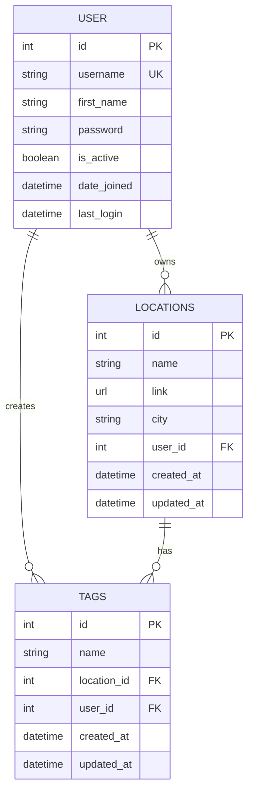

# Location Keeper 📍

A Django-based web application that allows users to manage and organize their saved locations with tags, making it easy to keep track of favorite places, visited locations, and points of interest.

🌐 **Live Demo**: [https://location-keeper.vercel.app](https://location-keeper.vercel.app)

## 🌟 Features

- **User Authentication**: Secure login and registration system
- **Location Management**: Add, edit, and delete saved locations
- **Tagging System**: Organize locations with custom tags
- **Geolocation Integration**: Get current location automatically using browser geolocation
- **Search Functionality**: Search locations by name or tags
- **Responsive Design**: Modern, mobile-friendly interface
- **User Profile Management**: Update profile details and change passwords
- **Statistics Dashboard**: View saved locations, unique tags, and cities visited

## 🏗️ Project Structure

```
location_keeper/
├── dashboard/                    # Dashboard app for main user interface
│   ├── static/dashboard/css/     # Dashboard-specific CSS
│   ├── templates/dashboard/      # Dashboard HTML templates
│   ├── views.py                 # Dashboard views and logic
│   └── urls.py                  # Dashboard URL patterns
├── location_crud/               # Core location management app
│   ├── static/location_crud/    # Static files (CSS, JS)
│   │   ├── css/                # Location form styling
│   │   └── js/                 # JavaScript for location features
│   ├── templates/location_crud/ # Location management templates
│   ├── models.py               # Database models for locations and tags
│   ├── forms.py                # Django forms for location input
│   ├── views.py                # Location CRUD views
│   ├── services.py             # Business logic and utilities
│   └── urls.py                 # Location-related URL patterns
├── user_authentication/         # User auth system
│   ├── static/user_authentication/ # Auth-specific CSS
│   ├── templates/user_authentication/ # Login/register templates
│   ├── forms.py                # Authentication forms
│   ├── views.py                # Auth views (login, register, logout)
│   └── urls.py                 # Authentication URL patterns
├── userprofile/                 # User profile management
│   ├── static/userprofile/     # Profile-specific CSS
│   ├── templates/userprofile/  # Profile management templates
│   ├── forms.py                # Profile update forms
│   ├── views.py                # Profile management views
│   └── urls.py                 # Profile-related URL patterns
├── location_keeper/            # Main project directory
│   ├── settings.py             # Django settings and configuration
│   ├── urls.py                 # Main URL configuration
│   ├── utilities.py            # Shared utilities and mixins
│   └── wsgi.py                 # WSGI configuration
├── templates/                   # Global templates (navbar, etc.)
├── manage.py                   # Django management script
└── vercel.json                 # Vercel deployment configuration
```

## 🗄️ Database Schema

### Models Overview

#### User Model (Django's built-in)
- `id` (Primary Key)
- `username` (Unique)
- `first_name` (User's display name)
- `password` (Hashed)
- `is_active` (Account status)

#### Locations Model
```python
class Locations(models.Model):
    id = AutoField(primary_key=True)
    name = CharField()          # Location name (required)
    link = URLField()           # Google Maps or other location link (required)
    city = CharField()          # City name (optional)
    user_id = ForeignKey(User)  # Owner of the location
```

#### Tags Model
```python
class Tags(models.Model):
    id = AutoField(primary_key=True)
    name = CharField()              # Tag name (required)
    location_id = ForeignKey(Locations)  # Associated location
    user_id = ForeignKey(User)      # Owner of the tag
```

### Database Relationships
- **User ↔ Locations**: One-to-Many (One user can have multiple locations)
- **User ↔ Tags**: One-to-Many (One user can create multiple tags)
- **Locations ↔ Tags**: One-to-Many (One location can have multiple tags)

### Entity Relationship Diagram



## 🚀 Getting Started

### Prerequisites
- Python 3.8+
- Django 5.2+
- pip (Python package manager)

### Installation

1. **Clone the repository**
   ```bash
   git clone https://github.com/yourusername/location-keeper.git
   cd location-keeper
   ```

2. **Create virtual environment**
   ```bash
   python -m venv venv
   source venv/bin/activate  # On Windows: venv\Scripts\activate
   ```

3. **Install dependencies**
   ```bash
   pip install django python-decouple psycopg2-binary whitenoise
   ```

4. **Environment Configuration**
   Create a `.env` file in the root directory:
   ```env
   DJANGO_SECRET_KEY=your-secret-key-here
   DEBUG=True
   ALLOWED_HOSTS=127.0.0.1,localhost
   ENV=DEV
   CSRF_TRUSTED_ORIGINS=http://127.0.0.1:8000,http://localhost:8000
   
   # For production (optional)
   DB_NAME=your_db_name
   DB_USER=your_db_user
   DB_PASSWORD=your_db_password
   DB_HOST=your_db_host
   DB_PORT=your_db_port
   ```

5. **Database Setup**
   ```bash
   python manage.py makemigrations
   python manage.py migrate
   ```

6. **Create Superuser (optional)**
   ```bash
   python manage.py createsuperuser
   ```

7. **Run Development Server**
   ```bash
   python manage.py runserver
   ```

8. **Access the application**
   - Open your browser and navigate to `http://127.0.0.1:8000`
   - Register a new account or login with existing credentials

## 💡 Core Functionality

### Authentication System
- **Registration**: Create new user accounts with username, name, and password
- **Login/Logout**: Secure session-based authentication
- **Profile Management**: Update user details and change passwords
- **Account Deletion**: Soft delete functionality (deactivates account)

### Location Management
- **Add Locations**: Manual entry or automatic geolocation detection
- **Edit Locations**: Modify location details, links, and tags
- **Delete Locations**: Remove locations and associated tags
- **Location Links**: Support for Google Maps and other map services
- **City Tracking**: Optional city field for location categorization

### Tagging System
- **Dynamic Tags**: Add multiple tags per location
- **Tag Management**: Real-time tag addition/removal in forms
- **Search by Tags**: Find locations using tag-based search
- **Tag Statistics**: View unique tag counts in dashboard

### Dashboard Features
- **Statistics Overview**: 
  - Total saved locations
  - Unique tags count
  - Cities visited count
- **Location Grid**: Visual card-based location display
- **Search Functionality**: Real-time search by location name or tags
- **Quick Actions**: Direct access to directions, editing, and copying

### Technical Features
- **Responsive Design**: Mobile-first CSS with modern styling
- **Geolocation API**: Browser-based location detection
- **Real-time Search**: JavaScript-powered instant search
- **Form Validation**: Client and server-side validation
- **Security**: CSRF protection, user authentication required
- **Admin Interface**: Django admin for data management

## 🔧 Configuration

### Environment Variables
- `DJANGO_SECRET_KEY`: Django secret key for security
- `DEBUG`: Debug mode (True/False)
- `ALLOWED_HOSTS`: Comma-separated list of allowed hosts
- `ENV`: Environment type (DEV/PROD)
- `CSRF_TRUSTED_ORIGINS`: Trusted origins for CSRF

### Database Configuration
- **Development**: SQLite (default)
- **Production**: PostgreSQL support with environment variables

## 🚀 Deployment

### Vercel Deployment
The project includes `vercel.json` for easy Vercel deployment:

1. Install Vercel CLI: `npm i -g vercel`
2. Run: `vercel --prod`
3. Configure environment variables in the Vercel dashboard

### Production Settings
- Set `ENV=PROD` in environment variables
- Configure PostgreSQL database credentials
- Update `ALLOWED_HOSTS` and `CSRF_TRUSTED_ORIGINS`
- Collect static files: `python manage.py collectstatic`

## 🛡️ Security Features

- **Authentication Required**: All location operations require login
- **User Isolation**: Users can only access their own data
- **CSRF Protection**: All forms include CSRF tokens
- **Input Validation**: Server-side form validation
- **Password Security**: Django's built-in password hashing
- **SQL Injection Prevention**: Django ORM protection

## 🎨 UI/UX Features

- **Modern Design**: Gradient backgrounds and smooth animations
- **Responsive Layout**: Works on desktop, tablet, and mobile
- **Interactive Elements**: Hover effects and smooth transitions
- **User Feedback**: Success/error messages for all operations
- **Intuitive Navigation**: Clear navigation structure with active states
- **Accessibility**: Semantic HTML and proper form labels

---

**Made with ❤️ using Django**
